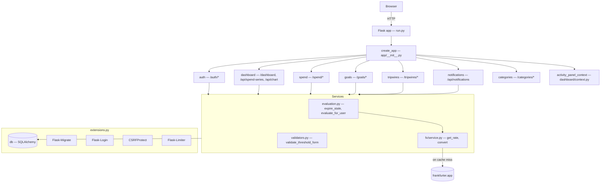
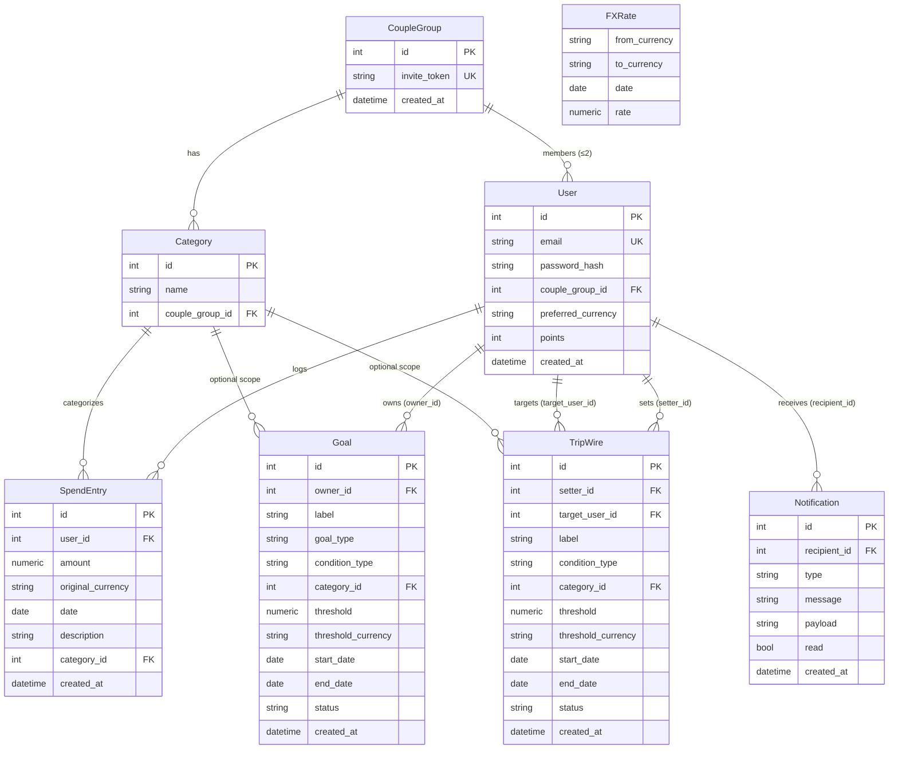
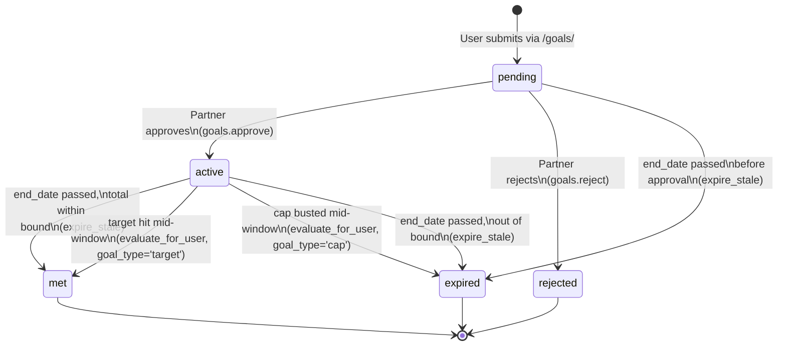

# CoupleFight — Hand-off documentation

Read end-to-end to take ownership of this codebase without further AI help. Everything below was verified against the working tree at the time of writing — if the code disagrees with what's here, **trust the code**.

---

## 1. Overview

CoupleFight is a small Flask web app for two people in a relationship to gamify their personal spending. Each user logs their own spend entries. They can set **goals** for themselves (spending caps or targets, e.g. "spend no more than $500 on Food in June") that require the partner to approve, and they can set **trip wires** on each other (e.g. "alert me if my partner spends > $200 on Shopping in June"). Goals met and trip wires tripped each earn the relevant user +10 points. Points are tracking-only; there's no redemption. See the long-form spec at [START.md](START.md) and the user-facing README at [README.md](README.md).

The app is single-server, single-process, no background worker. All background work (expiring stale goals/trip wires, evaluating thresholds after spend changes) piggybacks on user requests.

---

## 2. Quick start

### Environment

Copy [.env.example](.env.example#L1-L16) to `.env` and edit. Variables:

| Var | Required | Default | Notes |
|---|---|---|---|
| `SECRET_KEY` | prod | `dev-only-insecure-key-change-me` | Required when `FLASK_ENV=production` ([app/__init__.py:16-20](app/__init__.py#L16-L20)). |
| `DATABASE_URL` | no | `sqlite:///couplefight.db` | Postgres example in `.env.example`. |
| `FX_API_BASE` | no | `https://api.frankfurter.app` | Free, no API key. |
| `SESSION_COOKIE_SECURE` | prod | `0` | Set `1` behind HTTPS so the session cookie gets `Secure`. |
| `FLASK_ENV` | no | unset | Setting `production` makes `SECRET_KEY` mandatory. |

### Run — POSIX

```bash
./startup.sh
```

[startup.sh](startup.sh) is idempotent: creates `.venv`, installs `requirements.txt`, copies `.env` if missing, generates a fresh `SECRET_KEY`, runs migrations, then starts Flask on `0.0.0.0:5000`.

### Run — Windows

```powershell
.\startup.ps1
```

[startup.ps1](startup.ps1) is the PowerShell port of `startup.sh` with the same behavior.

### Manual run

```bash
python -m venv .venv && source .venv/bin/activate    # or .venv\Scripts\Activate.ps1 on Windows
pip install -r requirements.txt
cp .env.example .env                                 # then edit SECRET_KEY
export FLASK_APP=run.py
flask db upgrade                                     # migrations live in migrations/versions/
flask run
```

[run.py](run.py) just calls the [`create_app`](app/__init__.py#L13) factory; nothing else lives there.

---

## 3. Architecture



**Blueprints** are registered in [app/__init__.py:53-67](app/__init__.py#L53-L67). Each lives in its own package (`app/<name>/__init__.py` + `app/<name>/routes.py`); the package `__init__` files are empty by convention. URL prefixes:

| Blueprint | Prefix | File |
|---|---|---|
| `auth` | `/auth` | [app/auth/routes.py](app/auth/routes.py) |
| `dashboard` | `/` (root) | [app/dashboard/routes.py](app/dashboard/routes.py) |
| `spend` | `/spend` | [app/spend/routes.py](app/spend/routes.py) |
| `goals` | `/goals` | [app/goals/routes.py](app/goals/routes.py) |
| `tripwires` | `/tripwires` | [app/tripwires/routes.py](app/tripwires/routes.py) |
| `notifications` | `/api` | [app/notifications/routes.py](app/notifications/routes.py) |
| `categories` | `/categories` | [app/categories/routes.py](app/categories/routes.py) |

**Extensions** ([app/extensions.py](app/extensions.py)) are instantiated at import time but `init_app`-ed in the factory at [app/__init__.py:35-39](app/__init__.py#L35-L39): `db` (SQLAlchemy), `migrate` (Alembic), `login_manager` (Flask-Login with `session_protection = "strong"`), `csrf` (CSRFProtect), `limiter` (Flask-Limiter with a 200/minute default; auth routes override with their own decorators).

**Security headers** ([app/__init__.py:78-97](app/__init__.py#L78-L97)) are added in an `after_request`: `X-Content-Type-Options: nosniff`, `X-Frame-Options: DENY`, `Referrer-Policy: strict-origin-when-cross-origin`, a strict CSP that only allows the Tailwind and jsDelivr CDNs plus `'unsafe-inline'` for scripts/styles, and HSTS only when `SESSION_COOKIE_SECURE` is set (i.e., behind HTTPS).

**Services** layer ([app/services/](app/services/)) contains pure-ish business logic invoked by routes:
- [evaluation.py](app/services/evaluation.py) — `expire_stale()` (sweep past-end-date goals/tripwires) and `evaluate_for_user()` (recheck thresholds after a spend).
- [validators.py](app/services/validators.py) — shared form validation for goal + tripwire (date order, category-belongs-to-group).

**FX subsystem** ([app/fx/service.py](app/fx/service.py)) — see section 9.

**Templates** in [app/templates/](app/templates/) extend [base.html](app/templates/base.html). The persistent `_activity_panel.html` is included on every authenticated page via the `activity_panel_context` context processor registered at [app/__init__.py:75-76](app/__init__.py#L75-L76).

**Static assets** in [app/static/](app/static/): three JS files (`chart.js`, `notifications.js`, `activity-panel.js`, plus the small `category_inline.js`) and one CSS file ([app.css](app/static/css/app.css)). Tailwind, Chart.js, the date-fns adapter, and the Chart.js zoom plugin all load from jsDelivr — pinned versions in [base.html:8-12](app/templates/base.html#L8-L12).

---

## 4. Data model



All models live in [app/models.py](app/models.py).

**CoupleGroup** ([models.py:16-33](app/models.py#L16-L33)) — the join entity between two users. `invite_token` is a `secrets.token_urlsafe(32)` value generated at insert; the partner joins via `/auth/couple/join/<token>`. Invariant: at most two members. Enforced procedurally in `is_full()` and at the join route — **not** at the DB layer. The `categories` relationship cascades on delete.

**User** ([models.py:36-74](app/models.py#L36-L74)) — uses Flask-Login's `UserMixin`. Email is normalized to `.lower().strip()` and currency to `.upper()` via SQLAlchemy `@validates`. Password hashing is Argon2id via `argon2-cffi`; `check_password` opportunistically re-hashes if the parameters change (`check_needs_rehash`). The minimum password length is enforced in `set_password` itself, not in the form. `couple_group_id` is nullable — a user can exist without a group.

**Category** ([models.py:77-88](app/models.py#L77-L88)) — scoped to a couple group via `couple_group_id`. `UniqueConstraint(couple_group_id, name)` prevents duplicate category names within a group. Default categories are seeded at couple-group creation by [`_seed_categories`](app/auth/routes.py#L20-L22) using [`DEFAULT_CATEGORIES`](app/auth/routes.py#L14-L17).

**SpendEntry** ([models.py:91-104](app/models.py#L91-L104)) — stores the amount in its **original currency** plus the date and category. Conversion to viewer's preferred currency happens at read time via `app/fx/service.convert`, never at write time. This is a deliberate invariant — see section 9.

**FXRate** ([models.py:107-118](app/models.py#L107-L118)) — daily cache of FX rates from frankfurter.app. `UniqueConstraint(from_currency, to_currency, date)` so each pair is fetched at most once per day.

**Goal** ([models.py:121-142](app/models.py#L121-L142)) — owned by a user (`owner_id`). `condition_type` is `total` or `category`; if `category` the `category_id` FK is required by the validator (not by the DB). `goal_type` is `cap` (rewarded for staying ≤ threshold) or `target` (rewarded for reaching ≥ threshold). `status` transitions through `pending → active → met | expired | rejected`. **`tier` is never stored** — it's a `@property` derived via [`classify_tier`](app/config.py#L8-L15) at read time. This is a load-bearing design rule called out in [START.md](START.md).

**TripWire** ([models.py:145-167](app/models.py#L145-L167)) — set by one user (`setter_id`) targeting the partner (`target_user_id`). `status` transitions through `active → tripped | expired`. No approval — trip wires are active immediately on creation. Like Goal, `tier` is a `@property`.

**Notification** ([models.py:170-179](app/models.py#L170-L179)) — append-only event log addressed to a single user. `type` is a string tag (`goal_pending`, `goal_approved`, `goal_rejected`, `goal_met`, `goal_busted`, `goal_expired`, `tripwire_tripped`, `tripwire_expired`); `payload` carries an entity ref like `"goal:42"` or `"tripwire:7"` so the bell drawer can render inline action buttons.

---

## 5. Folder + file inventory

Root:
- [run.py](run.py) — WSGI entrypoint; just imports `create_app()`.
- [startup.sh](startup.sh) — POSIX bootstrap (venv, deps, .env, migrate, run).
- [startup.ps1](startup.ps1) — Windows/PowerShell port of the above.
- [requirements.txt](requirements.txt) — Python deps, all pinned by exact version.
- [.env.example](.env.example) — env-var template.
- [CLAUDE.md](CLAUDE.md) — project-level rules for AI-assisted edits.
- [README.md](README.md) — user-facing setup and architecture summary.
- [START.md](START.md) — original product spec written as an XML brief.

`app/`:
- [app/__init__.py](app/__init__.py) — `create_app()` factory; registers blueprints, configures extensions, sets security headers.
- [app/config.py](app/config.py) — `TIER_THRESHOLDS` dict and `classify_tier(start, end)` function.
- [app/extensions.py](app/extensions.py) — instantiates `db`, `migrate`, `login_manager`, `csrf`, `limiter`.
- [app/models.py](app/models.py) — all 7 SQLAlchemy models (`CoupleGroup`, `User`, `Category`, `SpendEntry`, `FXRate`, `Goal`, `TripWire`, `Notification`).

`app/auth/`:
- [routes.py](app/auth/routes.py) — `register`, `login`, `logout`, `profile`, `create_couple`, `join_couple`, `leave_couple`. Includes the `DEFAULT_CATEGORIES` list and `_seed_categories` helper.
- [forms.py](app/auth/forms.py) — `RegisterForm`, `LoginForm`, `ProfileForm`. Exposes `currency_choices()` (callable used as `SelectField.choices` by other blueprints' forms — single source of truth for the currency list).

`app/dashboard/`:
- [routes.py](app/dashboard/routes.py) — `home` (`/dashboard`), `spend_series` (`/api/spend-series` for the cumulative-spend chart), `chart_data` (`/api/chart` — see "Known gaps").
- [context.py](app/dashboard/context.py) — `activity_panel_context()` context processor that builds the `activity_panel_items` list (goals + tripwires + their completion dates derived from notifications).

`app/spend/`:
- [routes.py](app/spend/routes.py) — `index` (GET/POST `/spend/`) and `delete` (POST `/spend/<id>/delete`).
- [forms.py](app/spend/forms.py) — `SpendForm`. Custom `validate_date` rejects future dates.

`app/goals/`:
- [routes.py](app/goals/routes.py) — `index` (GET/POST `/goals/`), `approve`, `reject`.
- [forms.py](app/goals/forms.py) — `_ThresholdFormBase` (shared base for goals and tripwires), `GoalForm`, `TripWireForm`. `GOAL_TYPES = [("cap", ...), ("target", ...)]`.

`app/tripwires/`:
- [routes.py](app/tripwires/routes.py) — `index` (GET/POST `/tripwires/`). Note: the form class lives in `app/goals/forms.py` because it shares the `_ThresholdFormBase`.

`app/categories/`:
- [routes.py](app/categories/routes.py) — `create` (POST `/categories/`). Accepts both `application/json` (for the inline category creator on the spend form) and `application/x-www-form-urlencoded`. Returns JSON when the request was JSON, otherwise flashes + redirects.

`app/notifications/`:
- [routes.py](app/notifications/routes.py) — `list_notifications` (GET `/api/notifications` — polled every 30s by the bell), `mark_read` (POST `/api/notifications/<id>/read`), `mark_all_read` (POST `/api/notifications/read-all`).

`app/fx/`:
- [service.py](app/fx/service.py) — `get_rate(src, dst, on)` and `convert(amount, src, dst, on)`. Private helpers: `_cached_rate`, `_store_rate`, `_fetch_rate`.

`app/services/`:
- [evaluation.py](app/services/evaluation.py) — `expire_stale()` (sweeps past-end-date goals + tripwires) and `evaluate_for_user(user, on_date)` (rechecks thresholds after a spend). Includes a `_notify` helper.
- [validators.py](app/services/validators.py) — `validate_threshold_form(form, group_id) → (Category|None, error_msg|None)`. Used by both the goals and tripwires routes.

`app/templates/`:
- [base.html](app/templates/base.html) — layout, navbar, bell drawer, flash messages, CDN scripts, `` and ``.
- [_macros.html](app/templates/_macros.html) — `form_errors`, `tier_badge`, `status_badge` macros.
- [_activity_panel.html](app/templates/_activity_panel.html) — the persistent right-hand activity panel rendered on every authenticated page. Drives the chip-toggle-and-search filtering wired up by `activity-panel.js`.
- `auth/`: `register.html`, `login.html`, `profile.html`, `join_couple.html`.
- `dashboard/home.html` — points/currency/partner summary cards, the stock-chart-style spend visualization, embeds `chart.js`.
- `spend/index.html` — spend log form + recent-50-entries table + inline category creator.
- `goals/index.html` — goal creation form + lists ("My goals", "Pending approval").
- `tripwires/index.html` — trip wire creation form + lists ("Trip wires I set", "Trip wires against me").

`app/static/js/`:
- [chart.js](app/static/js/chart.js) — dashboard chart. Time-scale x-axis, today-dot marker, crosshair plugin, zoom plugin, W/M/Y viewport toggle. Fetches `/api/spend-series?range=1y` on load.
- [notifications.js](app/static/js/notifications.js) — bell drawer: poll `/api/notifications` every 30s, render items, wire up mark-read and the inline approve/reject buttons for `goal_pending`.
- [activity-panel.js](app/static/js/activity-panel.js) — chip/search/sort UI for the right-hand activity panel; persists state in `localStorage` under `cf.activity-panel.v1`; dispatches `activity-panel:changed` events that `chart.js` listens for.
- [category_inline.js](app/static/js/category_inline.js) — the "+ Add new category" button on the spend form (POSTs JSON to `/categories/`).

`app/static/css/`:
- [app.css](app/static/css/app.css) — one rule: `canvas { max-width: 100% }`. Everything else is Tailwind via CDN, with a small inline `<style>` block in [base.html:11-17](app/templates/base.html#L11-L17) for the activity-panel chips.

`migrations/`:
- Standard Alembic layout (`alembic.ini`, `env.py`, `script.py.mako`).
- `migrations/versions/04b7766a0518_init.py` — initial schema (all 7 tables).
- `migrations/versions/a1f2c3d4e5b6_goal_type.py` — adds `Goal.goal_type` column.

---

## 6. Key flows

### 6a. Couple group lifecycle

```mermaid
sequenceDiagram
    actor U1 as User A (browser)
    actor U2 as User B (browser)
    participant Auth as auth.routes
    participant Db as DB

    U1->>Auth: POST /auth/register
    Auth->>Db: User(email, password_hash)
    Auth-->>U1: login_user(); redirect /dashboard

    U1->>Auth: POST /auth/couple/create
    Auth->>Db: CoupleGroup(invite_token=…)
    Auth->>Db: User.couple_group_id = group.id
    Auth->>Db: _seed_categories(group) — 8 defaults
    Auth-->>U1: flash + redirect; dashboard shows invite link

    U1->>U2: shares /auth/couple/join/<token> out of band

    U2->>Auth: POST /auth/register (separate session)
    Auth-->>U2: redirect /dashboard

    U2->>Auth: GET /auth/couple/join/<token>
    Auth->>Db: CoupleGroup.query.filter_by(invite_token=token)
    Auth-->>U2: render confirm page (or 404 / "full" / "already in")

    U2->>Auth: POST /auth/couple/join/<token>
    Auth->>Db: User.couple_group_id = group.id
    Auth-->>U2: flash + redirect /dashboard
```

The "at most two members" invariant is enforced at the join step by [`CoupleGroup.is_full()`](app/models.py#L26-L27) and the `if group.is_full()` check at [auth/routes.py:119-121](app/auth/routes.py#L119-L121). There is **no** DB-level constraint preventing a third row from being inserted concurrently; the check is racy, but in practice both partners are very unlikely to race against an unknown third party.

### 6b. Spend creation → evaluation → notification → poll

```mermaid
sequenceDiagram
    actor U as User (browser)
    participant Spend as spend.routes
    participant Eval as services/evaluation.py
    participant FX as fx/service.py
    participant Db as DB
    participant Notif as notifications.routes
    participant Chart as static/js/chart.js

    U->>Spend: POST /spend/ (form data)
    Spend->>Db: SpendForm.validate_on_submit()
    Spend->>Db: Category authz check (must belong to couple)
    Spend->>Db: INSERT SpendEntry
    Spend->>Eval: evaluate_for_user(user, on_date)
    Eval->>Db: SELECT active Goals owned by user
    loop per active goal in window
        Eval->>FX: convert(spend, original_curr, threshold_curr, date)
        FX->>Db: SELECT FXRate cache hit?
        alt cache miss
            FX-->>FX: HTTP GET frankfurter.app
            FX->>Db: INSERT FXRate
        end
        Eval->>Db: status='met' or 'expired' (busted); +10 points if met
        Eval->>Db: INSERT Notification (owner + partner)
    end
    Eval->>Db: SELECT active TripWires targeting user
    loop per active tripwire in window
        Eval->>FX: convert(...)
        Eval->>Db: status='tripped'; +10 pts to setter; 2x Notification
    end
    Eval->>Db: COMMIT
    Spend-->>U: flash + redirect /spend/

    Note over U,Notif: ≤ 30s later, the bell poll picks up the new notifications.
    U->>Notif: GET /api/notifications
    Notif->>Eval: try expire_stale() (best-effort)
    Notif->>Db: SELECT 50 notifications
    Notif-->>U: JSON {unread, points, items}

    Note over U,Chart: Next /dashboard load reflects the new spend in the cumulative chart.
    U->>Chart: GET /dashboard → /api/spend-series?range=1y
    Chart-->>U: redraw with today-dot at the new cumulative value
```

The important behaviors to note:
- **Cap goals trip mid-window**: if cumulative spend exceeds the threshold inside the window, the goal is set to `expired` immediately (status name is misleading — it really means "busted"). See [evaluation.py:100-109](app/services/evaluation.py#L100-L109).
- **Target goals also resolve mid-window**: hitting the threshold mid-window awards the +10 immediately. See [evaluation.py:89-99](app/services/evaluation.py#L89-L99).
- **Cap goals never go to `met` mid-window**: that transition only happens in `expire_stale()` after `end_date` has passed. The user can't "win" a cap until the window closes. See [evaluation.py:46-57](app/services/evaluation.py#L46-L57).
- **Trip wires are bidirectional**: both the setter and the target get a notification when one trips. See [evaluation.py:123-126](app/services/evaluation.py#L123-L126).

---

## 7. Goal & TripWire state machine



**TripWire** is simpler — only three states: `active → tripped` (when target's spend exceeds threshold inside the window, in [evaluation.py:118-119](app/services/evaluation.py#L118-L119)) or `active → expired` (when `end_date` passes without tripping, in [evaluation.py:65-71](app/services/evaluation.py#L65-L71)). No `pending` state — trip wires don't need partner approval.

**Where transitions happen**:
- `pending → active | rejected`: explicit user action via `goals.approve` / `goals.reject`.
- `active → met | expired` mid-window: `evaluate_for_user()`, called from `spend.index` after a successful `INSERT SpendEntry`.
- Any `active → met | expired` at window close: `expire_stale()`, called best-effort from `dashboard.home` and `notifications.list_notifications`. Status transitions for `cap` goals "won" by reaching window-end without busting only happen in `expire_stale`.

---

## 8. Frontend

All pages extend [base.html](app/templates/base.html). It mounts the navbar (with the bell drawer), shows flash messages, and yields `` plus an optional `` for page-specific JS.

The right-hand **activity panel** ([_activity_panel.html](app/templates/_activity_panel.html)) is included for authenticated users from [base.html:71-73](app/templates/base.html#L71-L73). The data comes from the `activity_panel_context` context processor at [app/dashboard/context.py:43-94](app/dashboard/context.py#L43-L94), which builds a merged list of the user's goals and the trip wires targeting the user, joined to the latest state-change notification (used as a proxy for "completion date"). [activity-panel.js](app/static/js/activity-panel.js) wires up the chip filters, search box, sortable columns, and dispatches an `activity-panel:changed` custom event that [chart.js](app/static/js/chart.js#L107) listens for to re-render with the currently-visible items as overlays.

The **dashboard chart** ([app/static/js/chart.js](app/static/js/chart.js)) is the most complex piece of frontend. It:
- Always fetches `/api/spend-series?range=1y` on load (one fetch per page; viewport is client-side only).
- Uses a Chart.js **time-scale** x-axis via the date-fns adapter.
- Renders a slate area-fill for overall cumulative, plus per-goal/per-tripwire overlay lines and 2-point dashed threshold segments.
- Plots a prominent red "Today" dot at the latest cumulative point.
- Registers an inline **crosshair plugin** that draws dashed guides from the cursor to both axes (Google-Finance style).
- Uses **chartjs-plugin-zoom** for scroll-wheel zoom, drag-to-pan, and `chart.zoom()` calls from the `+` / `−` buttons.
- Clamps pan via `limits.x.min = first non-zero spend date` and `limits.x.max = today + 365d`.
- The `1W / 1M / 1Y` pill toggle sets `scales.x.min/max` to ±3 / ±15 / ±182 days centered on today and calls `chart.resetZoom()` first.

The **bell** ([notifications.js](app/static/js/notifications.js)) polls `/api/notifications` every 30s, renders a list, updates the unread badge and the points pill (`#points-pill`), and renders inline Approve/Reject form buttons for any item whose `type === 'goal_pending'` and whose `payload` parses as `goal:<id>`. All HTML is built via `innerHTML` with an explicit `escape()` helper applied to every variable interpolation.

The **inline category creator** on the spend form is [category_inline.js](app/static/js/category_inline.js): grabs `#new-cat-input` text, POSTs JSON to `/categories/`, then appends a new `<option>` to `#cat-select` and selects it.

**CDN deps** (all loaded from jsdelivr in [base.html:8-12](app/templates/base.html#L8-L12)):
- `https://cdn.tailwindcss.com` — Tailwind (no pinned version; whatever the CDN serves).
- `chart.js@4.4.4` — `chart.umd.min.js`.
- `chartjs-adapter-date-fns@3.0.0` — `chartjs-adapter-date-fns.bundle.min.js` (bundles date-fns).
- `chartjs-plugin-zoom@2.2.0` — `chartjs-plugin-zoom.min.js`.

None of these include SRI hashes. See section 11.

---

## 9. Currency / FX subsystem

The invariant: **monetary amounts are stored in their original currency, never pre-converted.** Conversion happens at read time, in the viewer's preferred currency.

[`SpendEntry`](app/models.py#L91-L104) carries `amount` plus `original_currency`. [`Goal`](app/models.py#L121-L142) and [`TripWire`](app/models.py#L145-L167) similarly carry `threshold` plus `threshold_currency`. The dashboard chart, the evaluation logic, and the activity panel all convert into the viewer's `preferred_currency` (or, for evaluation, the goal/tripwire's `threshold_currency`).

Conversion goes through [`convert(amount, src, dst, on_date)`](app/fx/service.py#L75-L79). That calls [`get_rate`](app/fx/service.py#L57-L72), which:
1. Returns `Decimal("1")` if `src == dst`.
2. Looks up the FXRate cache for that pair on that date.
3. On a cache miss, fetches from `${FX_API_BASE}/latest?from=SRC&to=DST` (default base is frankfurter.app — free, no API key).
4. Stores the fetched rate in the cache (wrapped in try/except + rollback so a cache write failure doesn't poison the calling transaction).

**When the FX API is down**: [`_fetch_rate`](app/fx/service.py#L39-L54) catches `requests.RequestException` and `ValueError`, logs a warning, and returns `Decimal("1")`. This means amounts will appear unconverted (i.e., 1:1) for the rest of that day's session for that currency pair. It's a deliberate trade-off — better than 500-ing the dashboard. Production deployments should alert on the warning log line `"FX fetch failed for X->Y"`.

The cache is keyed `(from_currency, to_currency, date)` with a unique constraint ([models.py:116-118](app/models.py#L116-L118)), so each pair is fetched at most once per day.

---

## 10. Background work (there is none — sort of)

There is no cron, no worker, no scheduler. Two pieces of work that *would* normally be background jobs are instead run lazily on user requests:

1. **`expire_stale()`** — sweeps `Goal`s and `TripWire`s whose `end_date < today` and moves them to terminal states. Called best-effort (wrapped in `try/except + log`) from:
   - [dashboard.home](app/dashboard/routes.py#L19-L23) on every dashboard load.
   - [notifications.list_notifications](app/notifications/routes.py#L17-L23) on every poll (which happens every 30s for an open browser tab).
2. **`evaluate_for_user()`** — rechecks the active goals and trip wires targeting the user after a spend. Called from [spend.index](app/spend/routes.py#L50) after `db.session.commit()` of the new `SpendEntry`.

Implication: if no one opens the dashboard or polls notifications for a week, goals' `end_date` boundaries are still respected only when someone visits next. Notifications fire late, but only by however long it takes for either user to come back.

There are **no tests** in the repo (no `tests/` directory) so this behavior isn't covered. See section 11.

---

## 11. Known gaps & "here be dragons"

These are real things in the code that a maintainer should know. I have not fixed them — only documented them.

- **`/api/chart` is orphaned.** [`dashboard.chart_data`](app/dashboard/routes.py#L156-L218) (with its `up_to` replay parameter) is defined but no client code calls it. Search `app/static/` and templates — zero references. It was likely scaffolding for the "Spend Replay" feature described in [README.md:95-97](README.md#L95-L97) which currently doesn't have a UI in [dashboard/home.html](app/templates/dashboard/home.html). Either remove the route or build the replay UI; right now it's an unused public endpoint.

- **Orphaned DOM IDs in [goals/index.html:23, 25](app/templates/goals/index.html#L23-L25).** `id="cond"` on the condition `<select>` and `id="cat-wrap"` on the category wrapper have **zero** JavaScript references (confirmed via grep over `app/static/`). They look like scaffolding for "hide the category dropdown when condition_type != category" that was never wired up. The corresponding [tripwires/index.html](app/templates/tripwires/index.html) doesn't have these IDs at all. The category dropdown is always visible on the goal form; the user can submit `condition_type=total` and still pick a category (which then gets ignored). Either wire the JS or remove the IDs.

- **`notifications.js` swallows poll errors silently.** [notifications.js:21](app/static/js/notifications.js#L21) is a `catch (e) { /* swallow */ }`. Network blips become invisible; users may see a stale bell count without warning. Consider logging to console or showing a "couldn't reach server" badge.

- **`expire_stale` failures are logged but never surfaced.** [dashboard/routes.py:20-23](app/dashboard/routes.py#L20-L23) and [notifications/routes.py:17-23](app/notifications/routes.py#L17-L23) both wrap `expire_stale()` in `try/except` + `log.exception`. If your logs aren't being scraped, repeated failures (DB schema drift, FX issues during `_spend_total_in_currency`) are invisible.

- **CSP allows `'unsafe-inline'`.** [app/__init__.py:84-90](app/__init__.py#L84-L90) — required because [base.html](app/templates/base.html) has inline `<style>` for activity-panel chips and the templates use inline event handlers (`onsubmit="return confirm(...)"` in [spend/index.html:59](app/templates/spend/index.html#L59)). Hardening would require moving everything to external files or hashing each inline block.

- **CDN scripts lack SRI hashes.** Tailwind, Chart.js, the date-fns adapter, and the zoom plugin are all loaded from jsdelivr by version but without `integrity=` / `crossorigin=`. A compromised CDN response would execute arbitrary JS. Pin once, generate SRI hashes once.

- **Race on "at most two members" in `CoupleGroup`.** [auth/routes.py:119-121](app/auth/routes.py#L119-L121) checks `group.is_full()` then commits. Two simultaneous joins by different users could both pass the check. No DB-level constraint protects against this. Low-probability but real.

- **`evaluate_for_user` flips `cap` goal status to `'expired'` mid-window when busted.** That's surprising naming — the status string reads "expired" but the meaning is "busted". The notification message is `"Goal busted (over threshold)"` which is the user-visible bit, but a future maintainer reading `Goal.status == 'expired'` will assume the date passed. Consider a separate `'busted'` status (would require a migration).

- **Trip wires that target a user with no spend in their threshold currency over the window can still trip via FX conversion.** This is correct behavior, just non-obvious — if A spends $100 USD but the threshold is in EUR, the FX rate determines whether the trip fires. Worth knowing when debugging "why didn't this trigger".

- **No tests.** The repo has no `tests/` directory, no `pytest`/`unittest` config. The evaluation logic (`evaluate_for_user`, `expire_stale`) and the currency conversion are the highest-value targets for a future test pass.

- **Tailwind via CDN is unpinned.** [base.html:8](app/templates/base.html#L8) loads `https://cdn.tailwindcss.com` without a version. A breaking Tailwind change would silently break styling.

- **`activity_panel_context` runs on every request, even non-HTML responses.** Returning `{}` early when `current_user.is_authenticated` is false ([context.py:44-45](app/dashboard/context.py#L44-L45)) is fine, but for authenticated users it issues 2 SELECTs + 2 more for the notification-derived completion dates on every request — including `/api/notifications` polls every 30s and `/api/spend-series` chart refreshes. Worth a measurement before scaling.

- **`User.password_hash` is `String(255)` but Argon2id encoded strings can exceed that depending on parameters.** Today's defaults fit, but if argon2-cffi defaults change in a future version, INSERTs may silently truncate the hash. Consider `String(512)` or `Text`.

---

## 12. Cookbook: how to make common changes

### Add a new supported currency

Edit [app/__init__.py:32](app/__init__.py#L32). The list is the single source of truth — `app/auth/forms.py::currency_choices()` reads from `current_app.config["SUPPORTED_CURRENCIES"]`, and all four currency-bearing form classes (`RegisterForm`, `ProfileForm`, `_ThresholdFormBase`, `SpendForm`) call that. No migration needed; the column is just `String(3)`.

### Add a new default seeded category

Edit `DEFAULT_CATEGORIES` at [app/auth/routes.py:14-17](app/auth/routes.py#L14-L17). New entries only seed for *future* couple groups (via `_seed_categories` called from `create_couple`). Existing groups are unaffected — their members can add categories manually via [category_inline.js](app/static/js/category_inline.js).

### Add a new notification type

1. Pick a tag (e.g. `"goal_paused"`). It's just a string in `Notification.type`.
2. At the trigger site (e.g. inside `evaluation.py`), call `_notify(user_id, "goal_paused", "Goal paused: …", payload="goal:<id>")`.
3. If you want inline action buttons in the bell drawer, add a handler in [notifications.js](app/static/js/notifications.js) around line 42 alongside the existing `goal_pending` branch — match on `n.type` and parse `n.payload`.
4. Optional: if the bucket should affect the activity-panel "Done" date, add the type to one of the constants in [app/dashboard/context.py:14-15](app/dashboard/context.py#L14-L15).

No migration needed.

### Bump a CDN dependency safely

1. Update the pinned version in [app/templates/base.html](app/templates/base.html) (8-12). Use exact versions, not version ranges.
2. Reload `/dashboard` and exercise the chart (toggle pills, hover, drag-pan, scroll-zoom). Reload `/spend/` and click "+ Add new category". Reload any authenticated page and open the bell.
3. If anything 404s in DevTools, the version probably moved on jsdelivr — check `https://www.jsdelivr.com/package/npm/<name>`.
4. (Optional, recommended) regenerate SRI hashes — but the project currently uses none, so this is opt-in hardening.

### Run a migration after a model change

```bash
flask db migrate -m "short description"
# Inspect migrations/versions/<new_file>.py — Alembic autogenerate is not magic
flask db upgrade
```

If autogenerate produced nothing surprising, commit the new file. If you renamed a column, Alembic will see drop+add — fix the generated file by hand to be `op.alter_column(... new_column_name=...)`.

### Add a new blueprint

1. `mkdir app/<name>` with empty `__init__.py`.
2. Create `app/<name>/routes.py` with `bp = Blueprint("<name>", __name__, template_folder="../templates")`.
3. Register in [app/__init__.py:53-67](app/__init__.py#L53-L67): `from .<name>.routes import bp as <name>_bp` and `app.register_blueprint(<name>_bp, url_prefix="/<name>")`.
4. Add templates under `app/templates/<name>/` (or reuse existing ones). Templates extend `base.html`.

---

*End of HANDOFF.md.*
